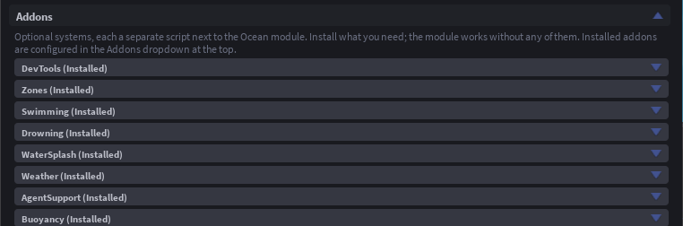
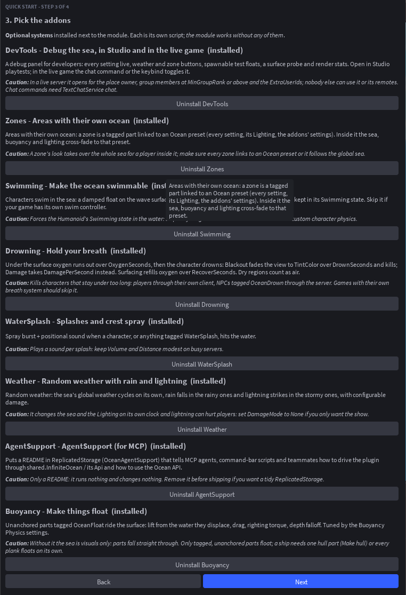
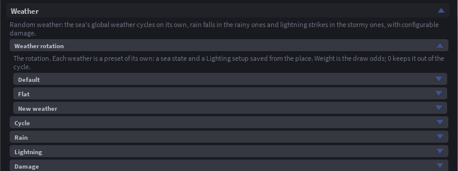
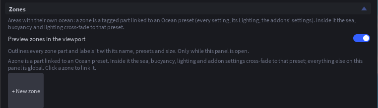

# Addons

Addons are optional scripts the plugin installs next to the module in `ReplicatedStorage` (`OceanBuoyancy`, `OceanSwimming` and so on). Each is independent: the module works without any of them, and you can add or remove one at any time from **More > Addons** or during Quick Start. An installed addon gets its own dropdown at the top of the panel with its settings; those settings are attributes on the addon script, so scripts can change them too.

## Buoyancy

Unanchored parts tagged `OceanFloat` ride the surface: lift from the water they displace, drag, and spin damping, tuned by the **Buoyancy Physics** settings and per part by the `OceanBuoyancy` (lift multiplier) and `OceanDrag` (drag multiplier) attributes. Without it the sea is visuals only and parts fall straight through.

A welded assembly with several tagged parts floats on all of them, so a wide hull rides level. **Make hull for selected boat** in the Tags section tags a boat model's corners for you. Parts inside an `OceanDry` region that belongs to the same model still float (a submarine's hull) while loose cargo inside it does not.

## Swimming

Characters swim in the sea: a damped float at the surface, water drag, and diving when the camera looks down. It sets the Humanoid's Swimming state, so skip it if your game has its own swim system.

| Setting | Default | What it does |
|---|---|---|
| `Enabled` | true | Characters swim |
| `CanJump` | true | Players can jump while swimming |
| `SwimSpring` | 30 | How stiffly a swimmer is held at the surface |
| `SwimIdleDrag` | 3 | Slowdown while no movement key is held |
| `DepthBuoyancyModifier` | 0.6 | How much a swimmer's lift fades over the first 10 studs below rest depth: 0 = full lift, 1 = none |

## Drowning

Under the surface oxygen runs out over `OxygenSeconds`, then the character drowns. **Blackout** fades the view to `TintColor` over `DrownSeconds` and then kills; **Damage** takes `DamagePerSecond` instead. Surfacing for `RecoverSeconds` refills the breath. Players drown through their own client (the server confirms the kill); NPCs tagged `OceanDrown` (any Model with a Humanoid) drown on the server.

| Setting | Default | What it does |
|---|---|---|
| `Enabled` | true | Characters can drown |
| `Mode` | Blackout | Blackout: pass out over DrownSeconds, then die. Damage: lose DamagePerSecond while drowning |
| `OxygenSeconds` | 30 | Seconds of breath under the surface |
| `DrownSeconds` | 10 | Blackout: seconds from out of breath to death |
| `RecoverSeconds` | 5 | Seconds at the surface to refill oxygen and clear the view |
| `DamagePerSecond` | 10 | Damage: health lost per second while drowning |
| `TintColor` | black | Blackout: the colour the view fades to |
| `TintMaxOpacity` | 1 | Blackout: how fully the tint covers the view at the end |

## WaterSplash

A spray burst and a positional sound when a character, or anything tagged `WaterSplash`, hits the water faster than `MinSpeed`, plus spray on wave crests near the camera (the `SplashRate` and `SplashHeight` visual settings). Per instance, the `SplashSoundId`, `SplashVolume` and `SplashDistance` attributes override the addon defaults.

| Setting | Default | What it does |
|---|---|---|
| `Characters` | true | Splash for player characters too |
| `MinSpeed` | 8 | Downward studs/s needed to splash |
| `SoundId` | impact_water | Default splash sound |
| `Volume` | 0.8 | Loudness of the splash sound |
| `Distance` | 120 | Studs the sound carries |
| `Particles` | 24 | Spray at MinSpeed; grows with impact |

## Weather

Random weather. The sea's global weather rotates on its own clock through a list you build in the panel: each entry is a sea state and a Lighting setup saved from the place, with a draw weight, and optional rain and lightning. Rain falls in the rainy ones (buildthomas' Rain), lightning strikes near players in the stormy ones (Quasiduck's Lightning-Beams) with thunder and optional damage. In Edit mode, **Preview this weather** shows any entry live.

| Group | Setting | Default | What it does |
|---|---|---|---|
| Cycle | `Enabled` | true | The weather rotates on its own |
| Cycle | `MinDuration` | 120 | Shortest time a weather lasts (seconds) |
| Cycle | `MaxDuration` | 300 | Longest time a weather lasts (seconds) |
| Cycle | `Transition` | 20 | Seconds the sea and Lighting cross-fade between weathers |
| Rain | `RainRate` | 400 | Drops per second |
| Rain | `RainSoundId` | (rain loop) | Looping rain sound |
| Rain | `RainVolume` | 0.5 | Loudness of the rain sound |
| Lightning | `StrikeMin` / `StrikeMax` | 4 / 15 | Shortest and longest gap between strikes (seconds) |
| Lightning | `StrikeRadius` | 200 | Strikes land within this of a random player |
| Lightning | `BoltHeight` | 300 | How tall a bolt is (studs) |
| Lightning | `BoltColor` | pale blue | Colour of the bolt |
| Lightning | `FlashBrightness` | 2 | How bright the sky flashes on a strike |
| Lightning | `ThunderSoundId` | (blank) | Blank = silent |
| Lightning | `ThunderVolume` / `ThunderDistance` | 1 / 1500 | Loudness of the thunder and how far it can be heard (studs) |
| Damage | `DamageMode` | Damage | None: light show only. Damage: humanoids in range take Damage. Explosion: that plus a blast |
| Damage | `Damage` | 50 | 0 = no health loss |
| Damage | `DamageRadius` | 12 | Studs |
| Damage | `BreakJoints` | false | Characters in range fall apart |
| Damage | `ExplosionPressure` | 500000 | Explosion mode: how hard the blast throws things |

## Zones

Areas with their own ocean. A zone is a part tagged `OceanZone` linked to an Ocean preset (every setting, its Lighting, or both), with optional physics, visual and lighting overrides on top. The sea cross-fades across the zone's rim over `OceanBlend` studs; a player entering the zone gets its look everywhere they look and its Lighting fades in over `OceanTransition` seconds. Zones can move and their settings change live. **Preview zones in the viewport** outlines them while editing.

Because a zone's look takes over the whole sea for a player inside it, keep zone looks close to the global one unless the change is the point.

## DevTools

A debug panel for developers: every setting live, weather and zone buttons, spawnable crates, rafts and buoys, a surface probe and a water-event log. It opens in Studio playtests and, in a live game, for the place owner, group members at `MinGroupRank` or above, and any `ExtraUserIds`, or for every player when `Everyone` is on. Toggle it with the chat command or the keybind.

| Setting | Default | What it does |
|---|---|---|
| `Enabled` | true | The window can be opened |
| `ToggleWith` | Both | What toggles the window: the chat command, the keybind, or either |
| `ChatCommand` | /ocean | Typed in chat to toggle the window |
| `Keybind` | F8 | Key that toggles the window (an Enum.KeyCode name) |
| `MinGroupRank` | 254 | Group games: the lowest group rank that gets the tools |
| `ExtraUserIds` | (blank) | More user ids that get the tools, comma separated |
| `Everyone` | false | Every player gets the tools (for a showcase place) |

## AgentSupport (for MCP)

Only a README. It puts `OceanAgentSupport` in ReplicatedStorage, a StringValue that tells MCP agents and command-bar scripts how to drive the plugin through `shared.InfiniteOcean` (install, presets, settings, tags, zones, weather, preview) and how to use the module API. It runs nothing and changes nothing; remove it before shipping if you want a tidy place.
