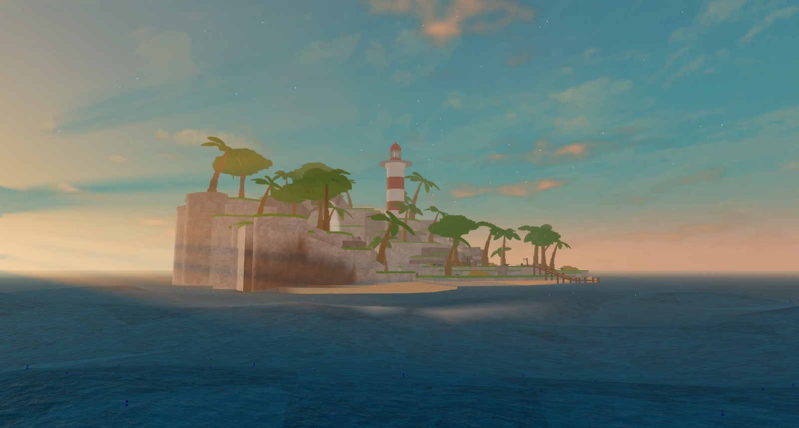

# Getting started

Infinite Ocean is an infinite, animated sea for Roblox. The **Studio plugin** installs and configures it with no code; the **Ocean module** it installs is open source and gives your scripts weather, water queries and events.

## Pick your path

  <a class="ocean-path" href="./no-scripting/">
    <h3>No Scripting Guide</h3>
    
Install, pick a preset, tag your island and boat, tune sliders, press Play. Everything in the plugin panel, nothing typed.

    Start here →
  </a>
  <a class="ocean-path" href="./advanced/">
    <h3>Advanced Guide</h3>
    
Settings, weather, zones, water queries and events from code, addon settings as attributes, and automating the plugin.

    For scripters →
  </a>

## What you get

- **An endless surface** of Gerstner waves drawn on a skinned `EditableMesh` that follows the camera, with crest foam, a translucent surface film, an underwater tint and a flat horizon out to the render distance.
- **Physics that match the visuals.** The same wave function runs on the server, so buoyancy, swimming and water events agree with what players see.
- **Weather.** Named sets of waves and colours that cross-fade over time, for the whole sea or for zones of it.
- **Tags.** `OceanFloat` floats a part, `OceanObstacle` calms the water around a pier or island, `OceanDry` keeps water out of a submarine, `OceanTrack` only reports water events, `OceanZone` gives an area its own sea.
- **Presets.** Whole oceans (Island, Pirate Seas, Oil Rig, Great Flood, Blank), physics (Calm, Rough, Huge, Tsunami, Still) and looks (Classic, Cartoony, Stylized, Realistic). Ocean presets also set Lighting and Atmosphere.
- **Addons.** Buoyancy, Swimming, Drowning, WaterSplash, Weather (rain, lightning, thunder, a weather cycle), Zones, DevTools and AgentSupport, each an optional script installed next to the module.
- **A live preview in Edit mode** that never touches your workspace or Lighting, so it is safe in Team Create.

## Install the plugin (both paths)

1. Get [**Infinite Ocean**](https://create.roblox.com/store/asset/76752250508724/Infinite-Ocean) from the Creator Store and enable it in Studio's Plugins tab.
2. Open the panel from the toolbar. The first time, read and accept the licence agreement.
3. Press **Install**, or start the **Quick Start** and let it walk you through physics, look and addons.

Install adds one ModuleScript, `ReplicatedStorage.Ocean`, with two small scripts inside it that start the sea on the server and on every client. Nothing else in the place changes.

:::info EditableMesh
The dynamic sea is drawn on an `EditableMesh`, which the experience has to allow in its Experience Settings. If it is not allowed, the plugin says so when you pick Dynamic Ocean and sets up a Flat Ocean instead, and the module falls back to a flat sea at runtime. Flat Ocean needs no permission.
:::

## Next steps

- Follow the [tutorial](./tutorial.md) to build a sea with an island, a boat and a storm.
- Read the [plugin guide](./plugin.md) for every panel section.
- Read the [scripting guide](./scripting.md) and the [API reference](/api/Ocean) to drive the sea from code.
