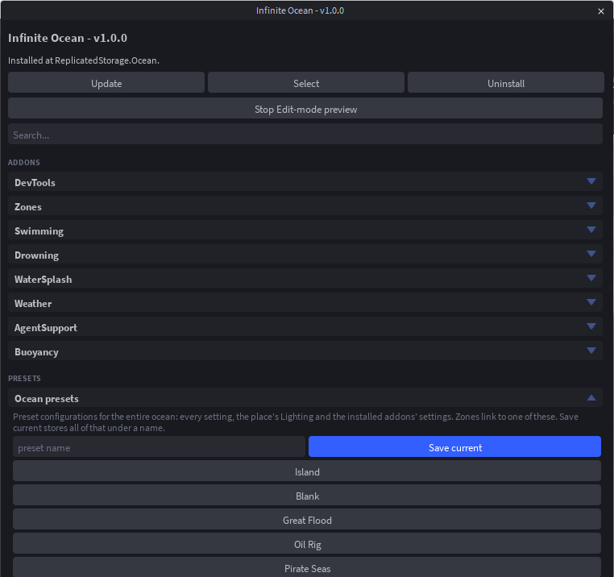

# No Scripting Guide

Two things: install the plugin, then let the Quick Start build your sea. Nothing is typed, and the whole thing takes about two minutes.

## 1. Install the plugin

1. Get [**Infinite Ocean**](https://create.roblox.com/store/asset/76752250508724/Infinite-Ocean) from the Creator Store.
2. In Studio, open the **Plugins** tab, press **Manage Plugins** and make sure Infinite Ocean is enabled.
3. Press the **Infinite Ocean** button in the Plugins toolbar to open the panel. The first time, read and accept the licence agreement.

## 2. Run the Quick Start

With no ocean in the place, the panel opens on the **Quick Start**. Press **Dynamic Ocean** (or **Flat Ocean** for a still, flat sea). It installs the module and then asks three questions.

**Pick the physics.** Calm is a gentle swell (the default), Rough is choppy, Huge is a long open-ocean swell, Tsunami is one wall of water, Still has no motion. Pressing one applies it and moves on. Not sure? Press **Calm**.

**Pick the look.** Classic is like Roblox water, Cartoony is matte and flat, Stylized is bright bands with solid foam, Realistic is reflective and detailed. Not sure? Press **Classic**.

**Pick the addons.** Tick what your game needs and press **Next**. For most games that is:

- **Buoyancy**: anything tagged `OceanFloat` floats and rocks on the waves.
- **Swimming**: characters swim when they walk into the water.
- **DevTools**: a debug panel in playtests (press **F8** or type `/ocean` in chat).

Drowning, WaterSplash, Weather (rain, lightning, thunder) and Zones are there too. You can add or remove any addon later from **More > Addons**.

**Finish.** The Edit-mode preview starts and the sea appears around the camera. It is drawn under the camera, not in the workspace, so nothing extra is saved into the place and Team Create teammates never see it. **Stop Edit-mode preview** at the top of the panel turns it off.

:::info EditableMesh
The dynamic sea is drawn on an `EditableMesh`, which the experience has to allow in its Experience Settings. If it is not allowed, the panel says so when you pick **Dynamic Ocean**: turn it on and pick Dynamic Ocean again, or press **Continue** to set up a Flat Ocean instead. Flat Ocean needs no permission.
:::

## 3. Press Play

That is a working sea. Press **Play**: the water moves, characters swim if you installed Swimming, and anything you tag `OceanFloat` floats. Everything the Quick Start chose is a slider in the panel, and every slider has a hint under it.

## Where next

- **Change the whole sea in one press**: open **Presets** and try Island, Pirate Seas, Oil Rig, Great Flood or Blank. Each also sets Lighting and Atmosphere. See [Presets](./presets.md).
- **Make the water respect your map**: the [tutorial](./tutorial.md) adds an island the waves calm around, a boat that floats and a storm, all from the panel.
- **Every panel section explained**: the [plugin guide](./plugin.md).
- **Storms on a timer, or a script that asks where the surface is**: the [Advanced Guide](./advanced.md).
