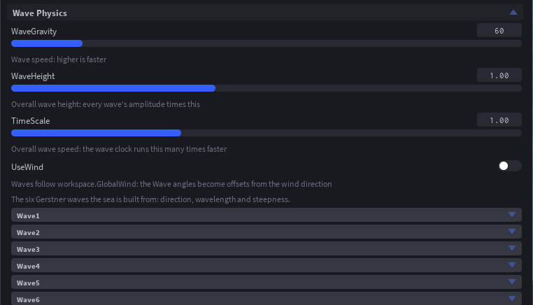
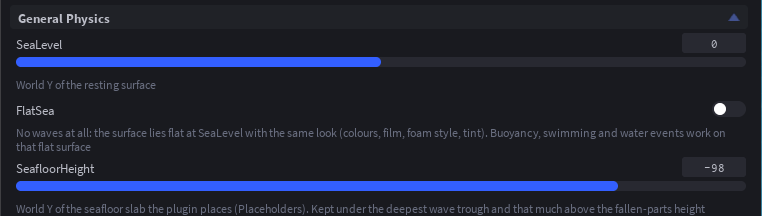
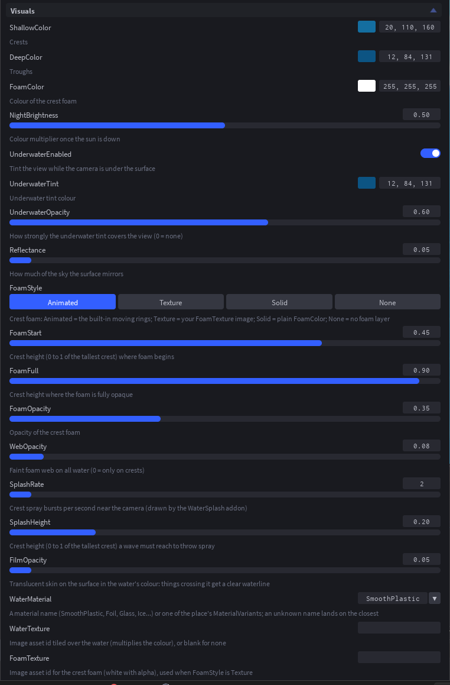
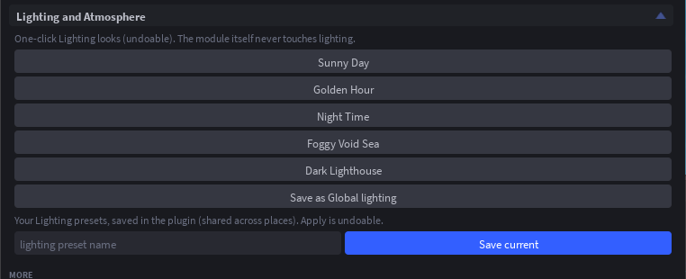
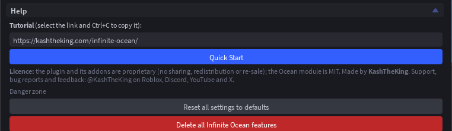

# Plugin guide

The panel is one dock widget. Every control has a hover tooltip, and every setting has a one-line hint under it. Type in the **Search** box to filter every section down to matching settings.

## Top

- **Status line**: whether the ocean is installed and which version.
- **Install / Update**, **Select** (selects `ReplicatedStorage.Ocean` in the Explorer), **Uninstall**.
- **Preview in Edit mode / Stop Edit-mode preview**: draws the sea around the camera while you edit. It lives under the Camera, so nothing is saved and Team Create teammates are unaffected. The preview starts on its own the first time the panel opens in a Studio session and after Quick Start.
- **Search**.

## Presets

Ocean, Physics and Visual presets, and **Save current** for your own. See [Presets](./presets.md).

## Addons

One dropdown per installed addon with its settings. See [Addons](./addons.md).

## Physics

**General Physics**: `SeaLevel`, `FlatSea`, `SeafloorHeight`.

**Wave Physics**: `WaveGravity`, `WaveHeight`, `TimeScale`, `UseWind`, then the six waves (angle, wavelength, steepness each).

**Buoyancy Physics**: density, drag, lift cap and depth falloff. Needs the Buoyancy addon.

**Tags (Object Behaviors)**: one sub-section per tag with the count of tagged things, **Tag selection / Untag selection**, **Select all**, the per-instance attributes and a list of what is tagged. See [Tags](./tags.md).

## Appearance

**Visuals**: crest and trough colours, foam colour and style, the underwater tint, reflectance, film, spray, material and textures.

**Performance**: live stats (fps, mesh update time, animated vertex count) and the mesh settings: quality, update rate, cell size, inner and outer cells, growth, render distance, and the Lit, Highlights, DynamicLighting, DynamicColors and StaticWaves toggles. See [Performance](./performance.md).

**Placeholders**: a flat water slab and a seafloor slab for building against when the preview is off. The water slab is hidden at runtime (it is the sea itself when `FlatSea` is on); the seafloor stays, with its own colour and material, but has no collision.

**Lighting and Atmosphere**: one-click Lighting looks (Sunny Day, Golden Hour, Night Time, Foggy Void Sea, Dark Lighthouse), **Save as Global lighting / Load Global lighting**, and your own saved Lighting presets. Every apply is undoable.

## More

**Addons**: install, uninstall or reinstall each addon (reinstalling keeps its settings).

**Help**: the tutorial link, **Quick Start**, the licence and contact details, and at the bottom the danger zone: **Reset all settings to defaults** and **Delete all Infinite Ocean features**, which removes the module, every addon, the placeholders and the plugin's tags after a confirmation page.

**About**: version, links and credits.

## Quick Start

**Flat Ocean** or **Dynamic Ocean** on the not-installed page, or **Quick Start** under Help. Four pages: physics, look, addons, what next. Pressing a preset applies it and moves on; **Skip** moves on without changing anything; **Finish** starts the preview. See the [tutorial](./tutorial.md).

## In a playtest

While the game runs, the panel shows a **Play mode** block first: live stats, weather buttons with a transition slider, **Zone ahead** (drops a scripted zone in front of the camera), spawnable crates, rafts and buoys, a surface probe and the water-event log. The DevTools addon puts the same tools inside the game for the server owner and testers.
