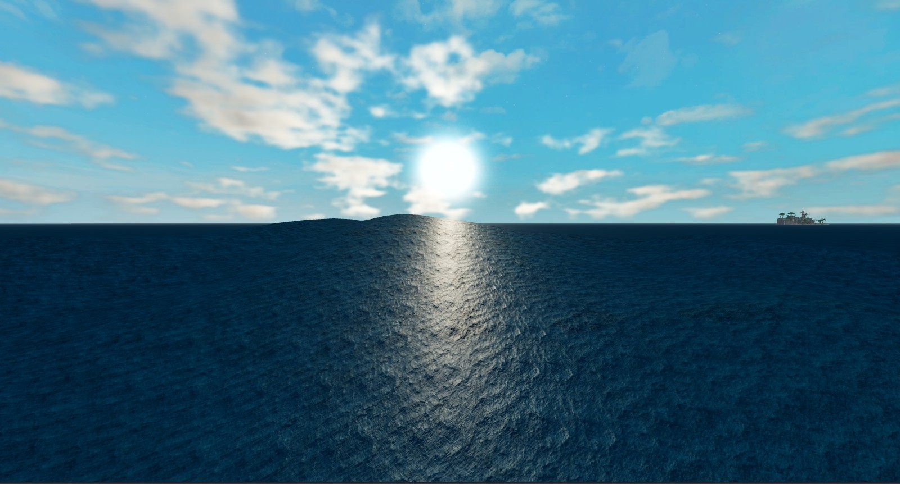
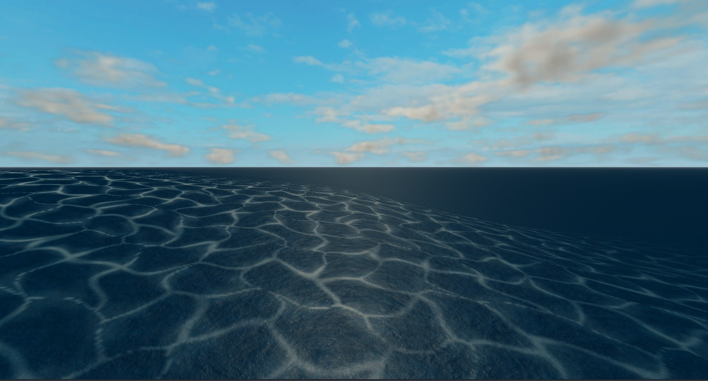
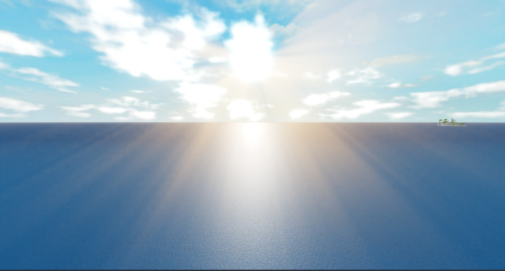

# Presets

A preset is a plain table of settings that applies on top of whatever is set. Three kinds, all in `Ocean.Presets` and in the panel's **Presets** heading.

## Ocean presets

A whole sea: one physics, one look, plus the Lighting and Atmosphere that suit it (the plugin applies those; the module itself never touches Lighting).

| Preset | Physics + look | The sea |
|---|---|---|
| **Island** | Calm + Classic | The defaults. A gentle swell in Roblox-water blue under a bright noon sky. |
| **Pirate Seas** | Rough + Stylized | Choppy, bright banded water with solid white foam, an overcast sky. |
| **Oil Rig** | Huge + Realistic | Long slow open-ocean swell, reflective grey-green water, low sun. |
| **Great Flood** | Tsunami + Realistic | Walls of water on the horizon, deep shadows, bloom and sun rays. |
| **Blank** | Still + minimal Classic | A flat, neutral sea with no foam, film or spray, under plain noon lighting. Start here for your own. |





## Physics presets

Waves and buoyancy only.

| Preset | Waves |
|---|---|
| **Calm** | The defaults: six waves from 48 to 320 studs, gentle steepness. |
| **Rough** | Longer, steeper, faster (WaveGravity 90): a choppy sea. |
| **Huge** | 600 to 900 stud swells, slow (WaveGravity 45): open ocean. |
| **Tsunami** | Two 1000 stud steep swells with small chop on top. |
| **Still** | Every steepness 0: a flat sea that still has all its visuals. |

## Visual presets

The look only: colours, foam, film, spray, material and textures.

| Preset | Look |
|---|---|
| **Classic** | Like Roblox water: its blue, a touch of reflection, faint animated crest foam. |
| **Cartoony** | A matte Slate slab in sky blue under a deeper-blue film with a faint tiled pattern. |
| **Stylized** | Bright flat bands with solid white foam, no reflection. |
| **Realistic** | Reflective, textured, detailed foam and film. |



## Your own

**Save current** in any Presets section stores the current settings under a name (Ocean presets also store the current Lighting). Saved presets are kept by the plugin across places, show up in Quick Start, and can be linked to zones and weathers. **Rename** and **Delete** sit next to each.

## From scripts

```lua
local Presets = Ocean.Presets
Presets.Ocean["Pirate Seas"]   -- a settings table
Presets.Physics.Huge
Presets.Visual.Stylized
Presets.Lighting["Great Flood"] -- the Lighting snapshot the plugin applies with it

-- presets double as weathers
Ocean:CreateWeather("Storm", Presets.Ocean["Pirate Seas"])

-- or apply one to the module directly (server)
for name, value in Presets.Physics.Rough do
	Ocean.Settings.Set(name, value)
end
```

Older names still resolve through `Presets.Find`: Storm, Deep Sea, Flat and Calm map to Pirate Seas, Oil Rig, Blank and Island.
