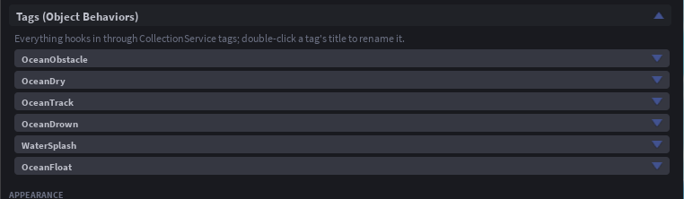

# Tags

Everything hooks into the sea through CollectionService tags. Add them from the panel's **Tags** section (select something, press **Tag selection**), from the Tag Editor, or from a script. Attributes on the tagged instance tune each one. The tag names can be renamed under Tags in the settings, or by double-clicking a tag's title in the panel.

| Tag | On | What happens | Attributes |
|---|---|---|---|
| `OceanFloat` | an unanchored BasePart | It floats (Buoyancy addon). Several tagged parts in one welded assembly float together. | `OceanBuoyancy` lift multiplier (1), `OceanDrag` drag multiplier (1) |
| `OceanObstacle` | a BasePart or Model | The sea calms against it: fully calmed out to `OceanShore` studs beyond its footprint, easing back to full waves over the same distance again. Floats and swimmers feel it too. | `OceanShore` studs (40), `OceanCalmness` 0 to 1 (1 = flat, 0.5 = half height) |
| `OceanDry` | a BasePart or Model | No water inside its box: the surface sinks under it, the underwater tint stays off inside, characters do not swim and water events treat it as air. Submarine interiors, underwater rooms, diving bells. | none |
| `OceanTrack` | anything with a position | Water events and `GetWaterState` for it, without floating it. | none |
| `OceanZone` | a BasePart or Model | The sea inside it is its own: any setting set as an attribute on the zone overrides the module's value there. Weather settings blend across the rim; buoyancy settings blend per assembly. | any setting name, `OceanBlend` rim width in studs (35% of the radius) |
| `WaterSplash` | anything | Splashes when it hits the water (WaterSplash addon). | `SplashSoundId`, `SplashVolume`, `SplashDistance` |
| `OceanDrown` | a Model with a Humanoid | An NPC that drowns like a player (Drowning addon). | none |

## Obstacles in practice

- **An island**: tag the island model. The beach is calm, the swell returns a shore-width out.
- **A harbour**: tag the breakwater, not the water. Inside stays flat while the sea outside rolls.
- **A pier on legs**: tag the deck with `OceanCalmness` 0.3 so waves pass under it, only softened.

Obstacles are re-read twice a second, so a moving ship tagged as an obstacle drags its calm patch with it.

## Dry regions in practice

Tag the interior box of a submarine. Its hull, tagged `OceanFloat` in the same model, still floats, because a dry box belonging to the same model or welded assembly does not cancel its own lift; cargo dropped inside does not float. A camera inside sees no tint, and a character inside walks.

## Zones in practice

Add the Zones addon and press **+ New zone**: it makes a tagged part, links it to a preset and fills the attributes for you. Without the addon, tag any part and set attributes by hand: `WaveHeight = 0.2` on a zone part gives a calm patch; `ShallowColor` and `DeepColor` give it its own colour.
