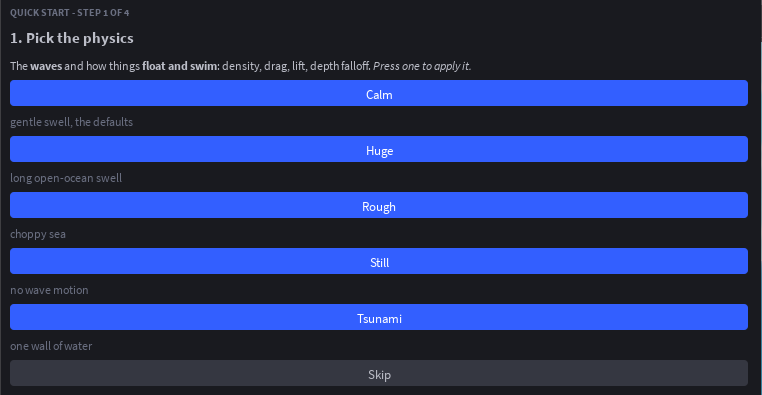
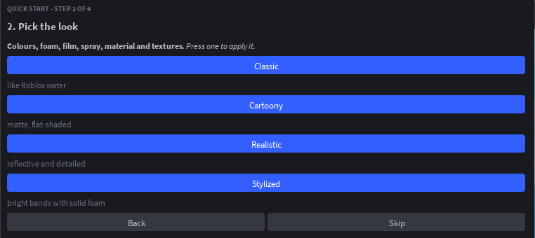
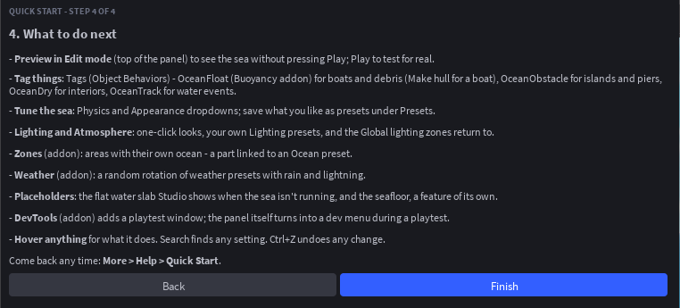
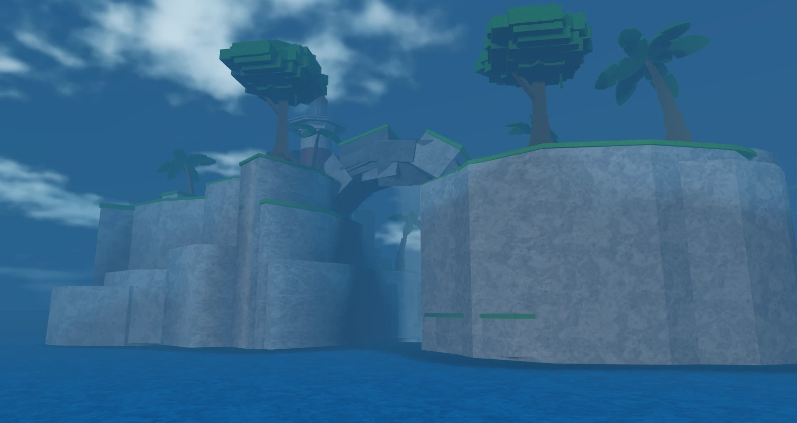

# Tutorial: an island, a boat and a storm

Fifteen minutes from an empty baseplate to a sea with a calm bay, a boat you can steer, players who swim, and a storm your server can call in. No code until the last step.

## 1. Install and Quick Start

Open the Infinite Ocean panel and press **Dynamic Ocean** under Quick Start. The wizard has four pages.



**Pick the physics.** Each button applies a physics preset and moves on: Calm is a gentle swell (the defaults), Rough is choppy, Huge is a long open-ocean swell, Tsunami is one wall of water, Still has no motion. Press **Calm**.



**Pick the look.** Classic is like Roblox water, Cartoony is matte and flat, Stylized is bright bands with solid foam, Realistic is reflective and detailed. Press **Classic**.


**Pick the addons.** For this tutorial install **Buoyancy** (things float), **Swimming** (characters swim) and **DevTools** (a debug panel in playtests). Press **Next**.



**Finish** starts the Edit-mode preview: the sea appears around the camera. It is drawn under the camera, not in the workspace, so nothing is saved into the place and Team Create teammates never see it.

## 2. Build an island

Build or import an island so it pokes through the surface at `SeaLevel` (0 by default). Water washes straight through parts, so make the sea respect the shore:

1. Select the island (a Model or a Part).
2. In the panel open **Tags** and, under `OceanObstacle`, press **Tag selection**.

The sea goes calm out to `OceanShore` studs beyond the island's footprint (40 by default) and eases back to full waves over the same distance again. Set the `OceanShore` and `OceanCalmness` attributes on the island to tune it: a calmness of 1 flattens the water completely, 0.5 halves the waves.

For a harbour, tag the breakwater instead of the island and the water inside stays quiet while the open sea keeps rolling.

## 3. A boat

Build a boat as a Model with one anchored-free assembly (parts welded together). Select the hull part and, under `OceanFloat` in Tags, press **Tag selection**. Unanchor it and press Play: it floats, rocks with the waves and drifts with drag.

Tune it on the hull with attributes:

- `OceanBuoyancy` scales the lift (1.3 sits higher, 0.8 sits lower).
- `OceanDrag` scales the drag.

Or globally under **Buoyancy Physics**: `WaterDensity`, `LinearDrag`, `AngularDrag`, `MaxLift`. For a wide boat that should not rock on every ripple, tag several parts across the hull, or select the boat Model and press **Make hull for selected boat** to tag its corners.

## 4. Swim

With the Swimming addon installed, characters that walk into the water swim: hold jump to surface, look down and move to dive. Under the addon's dropdown in the panel set `CanJump` (whether players can jump while swimming) and how the swim feels.

Anything a player should not swim through, such as the inside of a ship, gets the `OceanDry` tag: there is no water inside its box, the surface sinks under it and the underwater tint stays off.

## 5. Try the presets

Open **Presets**. An Ocean preset changes everything at once: waves, colours, foam, material, Lighting and Atmosphere. Press **Pirate Seas** and the sky darkens as the swell picks up; **Oil Rig** gives a long realistic swell; **Great Flood** puts walls of water on the horizon; **Blank** is a flat neutral sea to build your own from.



Physics and Visual presets change only their half. Save your own with **Save current** in any of the three sections; saved presets show up in Quick Start and in the Zones and Weather addons.

## 6. A storm from a script

Everything the panel does is an attribute on `ReplicatedStorage.Ocean`, and the module exposes weather. In a server Script:

```lua
local Ocean = require(game.ReplicatedStorage.Ocean)

-- the presets are plain tables of settings, so they double as weathers
Ocean:CreateWeather("Storm", Ocean.Presets.Ocean["Pirate Seas"])
Ocean:CreateWeather("Glassy", { WaveHeight = 0.25, FoamOpacity = 0, ShallowColor = Color3.fromRGB(70, 170, 210) })

while true do
	task.wait(120)
	Ocean:SetWeather("Storm", 30) -- cross-fade the whole sea over 30 seconds
	task.wait(90)
	Ocean:SetWeather("Default", 30) -- back to the panel's settings
end
```

The fade is a function of server time, so every client shows the same sea and the server's buoyancy agrees with it. To give only the bay its own weather:

```lua
Ocean:CreateZone("Bay", { Position = Vector3.new(0, 0, 2000), Radius = 800, Weather = "Glassy" })
```

Or, without code, install the **Zones** addon, press **+ New zone**, move the zone part over the bay and link it to a preset.

## 7. Ask the water

From any script, server or client:

```lua
local y = Ocean:GetHeight(position)           -- surface height right now
local deep = Ocean:GetDepth(position) > 5     -- more than 5 studs under
local normal = Ocean:GetSurfaceNormal(position)

Ocean.EnteredWater:Connect(function(instance) print(instance, "splash") end)
Ocean.WentUnderWater:Connect(function(instance) print(instance, "is under") end)
```

Events fire for player characters and for anything tagged `OceanFloat` or `OceanTrack`. The [scripting guide](./scripting.md) covers the rest.
